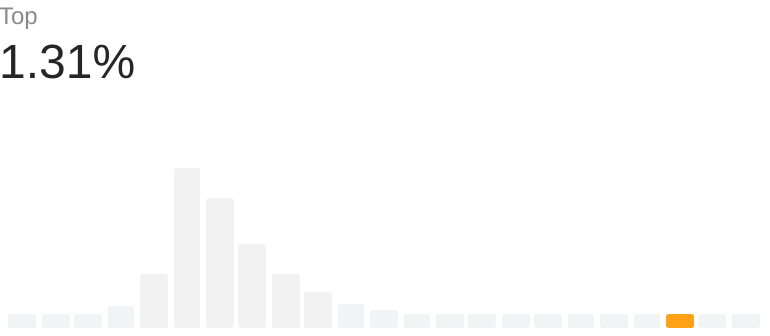

### 🌱 My Skills

### 🏆 Trophies

<!--  -->

## 🎯 Status

 
  
  

## 📈 LeetCode

<!--START_SECTION:leetcode-streak-updated-time-->

 
  <picture>
    <source media="(prefers-color-scheme: dark)" srcset="./images/problems_dark.png" height="140px">
    
  </picture>
  <picture>
    <source media="(prefers-color-scheme: dark)" srcset="./images/rating_top_dark.png" height="140px">
    
  </picture>

    
Last Updated on 4/3/2023, 4:54:36 AM
    
<!--END_SECTION:leetcode-streak-updated-time-->
