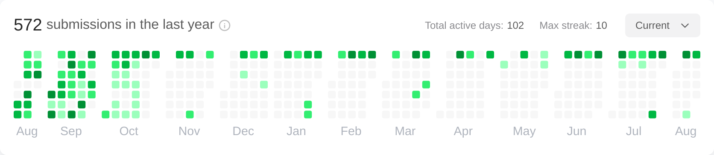

### 🌱 My Skills

### 🏆 Trophies

<!--  -->

## 🎯 Status

 
  
  

## 📈 LeetCode
<!--START_SECTION:leetcode-streak-updated-time-->

<picture>
  <source media="(prefers-color-scheme: dark)" srcset="./images/problems_dark.png" width="500">
  
</picture>
<picture>
  <source media="(prefers-color-scheme: dark)" srcset="./images/rating_dark.png">
  
</picture>
  
Last Updated on 2/19/2023, 1:26:15 PM
  
<!--END_SECTION:leetcode-streak-updated-time-->
